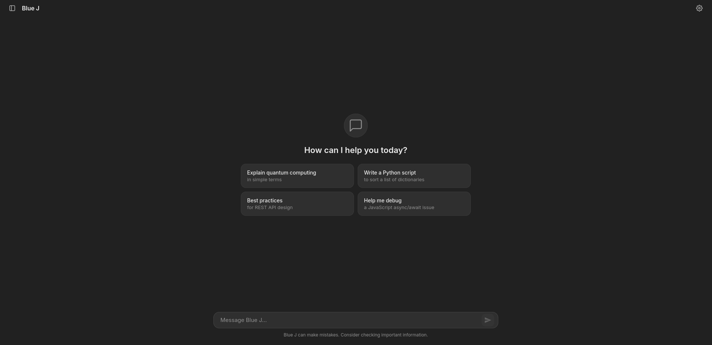
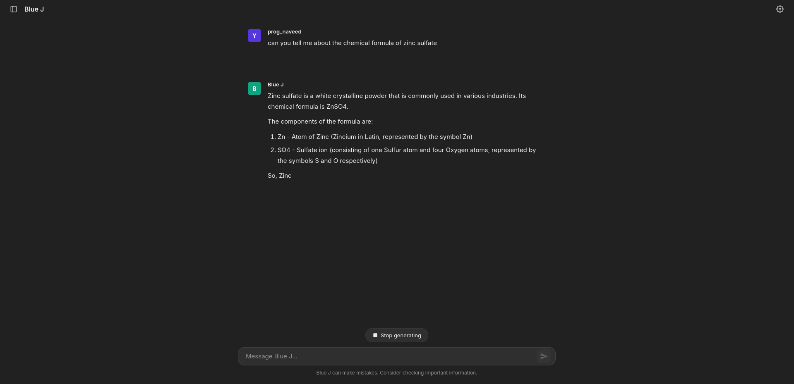
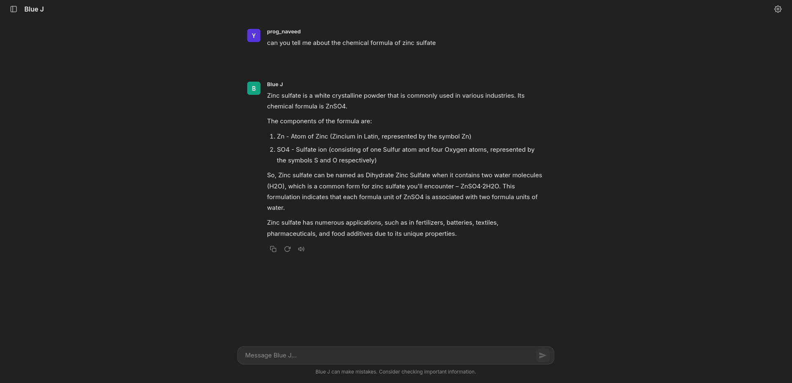

# Blue J

A modern, feature-rich chat interface for Ollama AI models with a sleek dark theme and intuitive user experience.





## Features

### Chat Interface

- **Real-time streaming responses** - See AI responses as they're generated
- **Markdown support** - Properly formatted text, code blocks, lists, and tables
- **Syntax highlighting** - Beautiful code highlighting with support for multiple languages
- **Copy functionality** - Easy one-click copying of code blocks and entire messages
- **Message actions** - Copy, regenerate, and text-to-speech for each response

### User Experience

- **Dark theme** - Easy on the eyes with a modern dark UI
- **Collapsible sidebar** - Maximize your chat space
- **Conversation history** - All chats saved locally with timestamps
- **Quick suggestions** - Get started with pre-made prompts
- **Empty state** - Clean welcome screen with helpful suggestions
- **Responsive design** - Works seamlessly on desktop and mobile devices

### Customization

- **Username configuration** - Personalize your chat with a custom display name
- **System prompts** - Configure AI behavior with custom system instructions
- **Persistent settings** - All preferences saved in browser storage

### Conversation Management

- **Multiple conversations** - Create and manage unlimited chat sessions
- **Auto-generated titles** - Conversations automatically titled from first message
- **Delete conversations** - Remove unwanted chat history
- **URL-based navigation** - Direct links to specific conversations
- **Browser history support** - Back/forward navigation between chats

### Smart Features

- **Regenerate responses** - Re-generate the last AI response with one click
- **Stop generation** - Cancel ongoing responses at any time
- **Text-to-speech** - Listen to AI responses with built-in TTS
- **Auto-scroll** - Automatically scrolls to new messages
- **Typing indicators** - Visual feedback while AI is thinking

## Getting Started

### Prerequisites

- [Ollama](https://ollama.ai/) installed and running on your system
- A web browser (Chrome, Firefox, Safari, or Edge)
- An Ollama model downloaded (default: `mistral:7b`)

### Installation

1. **Clone the repository**

   ```bash
   git clone https://github.com/uxlabspk/Blue_j.git
   cd Blue_j
   ```

2. **Start Ollama**

   ```bash
   ollama serve
   ```

3. **Pull a model** (if not already downloaded)

   ```bash
   ollama pull mistral:7b
   ```

4. **Open the application**
   - Simply open `index.html` in your web browser
   - Or serve it with a local server:

     ```bash
     # Using Python
     python -m http.server 8000

     # Using PHP
     php -S localhost:8000

     # Using Node.js (with http-server)
     npx http-server
     ```

5. **Start chatting!**
   - Navigate to `http://localhost:8000` (if using a server)
   - Or open `index.html` directly in your browser

## Project Structure

```
Blue_j/
├── index.html          # Main HTML structure
├── styles.css          # All styling and themes
├── chat.js             # Core functionality and logic
├── README.md           # This file
└── screenshot.png      # Application preview (add your own)
```

## Customization

### Changing the AI Model

Edit the model name in `chat.js`:

```javascript
// Line ~594
const requestBody = {
  model: "mistral:7b", // Change to your preferred model
  prompt: message,
  stream: true,
};
```

Available Ollama models: `llama2`, `codellama`, `mistral`, `mixtral`, `neural-chat`, etc.

### Customizing the Theme

All colors are defined as CSS variables in `styles.css`:

```css
:root {
  --bg-primary: #212121;
  --bg-secondary: #2f2f2f;
  --accent: #10a37f;
  --text-primary: #ececec;
  /* ... modify as needed */
}
```

### Adding System Prompts

Click the settings gear icon in the top-right corner to configure:

- **Username**: Personalizes your display name
- **System Prompt**: Instructions for the AI's behavior

Example system prompts:

- "You are a helpful coding assistant."
- "Answer concisely and accurately."
- "You are an expert in Python programming."

## Technical Stack

- **HTML5** - Semantic markup
- **CSS3** - Modern styling with CSS variables and animations
- **Vanilla JavaScript** - No frameworks, pure ES6+
- **Ollama API** - Local AI model inference
- **Marked.js** - Markdown parsing and rendering
- **Highlight.js** - Syntax highlighting for code blocks
- **LocalStorage** - Persistent data storage

## Key Features Breakdown

### Streaming Responses

Real-time token-by-token streaming from Ollama API for a natural chat experience.

### Conversation Persistence

All conversations are saved in browser LocalStorage with:

- Unique IDs
- Timestamps
- Full message history
- Auto-generated titles

### Message Actions

Each AI response includes:

- **Copy**: Copy entire message to clipboard
- **Regenerate**: Re-generate the response (only on last message)
- **Speak**: Text-to-speech audio playback

### Markdown Rendering

Full markdown support including:

- Headers and emphasis
- Code blocks with syntax highlighting
- Lists (ordered and unordered)
- Tables
- Blockquotes
- Links

## Browser Compatibility

- Chrome/Edge (Recommended)
- Firefox
- Safari
- Opera

## Privacy

- **100% Local** - All data stored in your browser
- **No external servers** - Communicates only with local Ollama instance
- **No tracking** - Zero analytics or telemetry
- **No accounts** - No sign-up or authentication required

## Troubleshooting

### "Failed to send message. Please check if Blue J is running."

**Solution**: Ensure Ollama is running:

```bash
ollama serve
```

### Responses not appearing

**Solution**: Check if the model is installed:

```bash
ollama list
ollama pull mistral:7b
```

### CORS errors in browser console

**Solution**: Use a local web server instead of opening the HTML file directly:

```bash
python -m http.server 8000
```

## Contributing

Contributions are welcome! Feel free to:

- Report bugs
- Suggest features
- Submit pull requests
- Improve documentation

## Acknowledgments

- [Ollama](https://ollama.ai/) - For the amazing local AI platform
- [Marked.js](https://marked.js.org/) - For markdown parsing
- [Highlight.js](https://highlightjs.org/) - For syntax highlighting
- [Inter Font](https://rsms.me/inter/) - For the beautiful typography

## Support

For issues and questions:

- Open an issue on [GitHub](https://github.com/uxlabspk/Blue_j/issues)
- Check [Ollama documentation](https://ollama.ai/docs)
